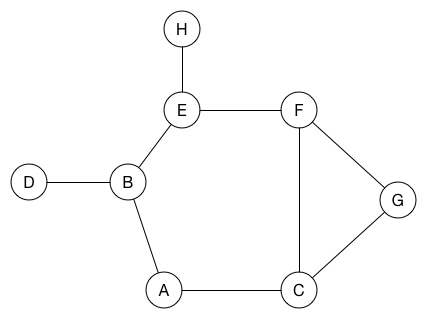

# Shortest Path (Unweighted Graph)

Goal: find the shortest route to go from one node to another in a graph.

Suppose we have to following graph:



We may want to find out what the shortest way is to get from node `A` to node `F`.

If the [graph is unweighed](../Graph/), then finding the shortest path is easy: we can use the breadth-first search algorithm. For a weighted graph, we can use Dijkstra's algorithm.

## Unweighted graph: breadth-first search

[Breadth-first search](../Breadth-First Search/) is a method for traversing a tree or graph data structure. It starts at a source node and explores the immediate neighbor nodes first, before moving to the next level neighbors. As a convenient side effect, it automatically computes the shortest path between a source node and each of the other nodes in the tree or graph.

The result of the breadth-first search can be represented with a tree:


The root of the tree is the node you started the breadth-first search from. To find the distance from node `A` to any other node, we simply count the number of edges in the tree. And so we find that the shortest path between `A` and `F` is 2. The tree not only tells you how long that path is, but also how to actually get from `A` to `F` (or any of the other nodes).

Let's put breadth-first search into practice and calculate the shortest path from `A` to all the other nodes. We start with the source node `A` and add it to a queue with a distance of `0`.

```swift
queue.enqueue(A)
A.distance = 0
```

The queue is now `[ A ]`. We dequeue `A` and enqueue its two immediate neighbor nodes `B` and `C` with a distance of `1`.

```swift
queue.dequeue()   // A
queue.enqueue(B)
B.distance = A.distance + 1   // result: 1
queue.enqueue(C)
C.distance = A.distance + 1   // result: 1
```

The queue is now `[ B, C ]`. Dequeue `B` and enqueue `B`'s neighbor nodes `D` and `E` with a distance of `2`.

```swift
queue.dequeue()   // B
queue.enqueue(D)
D.distance = B.distance + 1   // result: 2
queue.enqueue(E)
E.distance = B.distance + 1   // result: 2
```

The queue is now `[ C, D, E ]`. Dequeue `C` and enqueue `C`'s neighbor nodes `F` and `G`, also with a distance of `2`.

```swift
queue.dequeue()   // C
queue.enqueue(F)
F.distance = C.distance + 1   // result: 2
queue.enqueue(G)
G.distance = C.distance + 1   // result: 2
```

This continues until the queue is empty and we've visited all the nodes. Each time we discover a new node, it gets the `distance` of its parent plus 1. As you can see, this is exactly what the [breadth-first search](../Breadth-First Search/) algorithm does, except that we now also keep track of the distance travelled.

Here's the code:

```swift
func breadthFirstSearchShortestPath(graph: Graph, source: Node) -> Graph {
  let shortestPathGraph = graph.duplicate()

  var queue = Queue<Node>()
  let sourceInShortestPathsGraph = shortestPathGraph.findNodeWithLabel(source.label)
  queue.enqueue(sourceInShortestPathsGraph)
  sourceInShortestPathsGraph.distance = 0

  while let current = queue.dequeue() {
    for edge in current.neighbors {
      let neighborNode = edge.neighbor
      if !neighborNode.hasDistance {
        queue.enqueue(neighborNode)
        neighborNode.distance = current.distance! + 1
      }
    }
  }

  return shortestPathGraph
}
```

Put this code in a playground and test it like so:

```swift
let shortestPathGraph = breadthFirstSearchShortestPath(graph, source: nodeA)
print(shortestPathGraph.nodes)
```

This will output:

	Node(label: a, distance: 0), Node(label: b, distance: 1), Node(label: c, distance: 1),
	Node(label: d, distance: 2), Node(label: e, distance: 2), Node(label: f, distance: 2),
	Node(label: g, distance: 2), Node(label: h, distance: 3)

> **Note:** This version of `breadthFirstSearchShortestPath()` does not actually produce the tree, it only computes the distances. See [minimum spanning tree](../Minimum Spanning Tree/) on how you can convert the graph into a tree by removing edges.

*Written by [Chris Pilcher](https://github.com/chris-pilcher) and Matthijs Hollemans*
